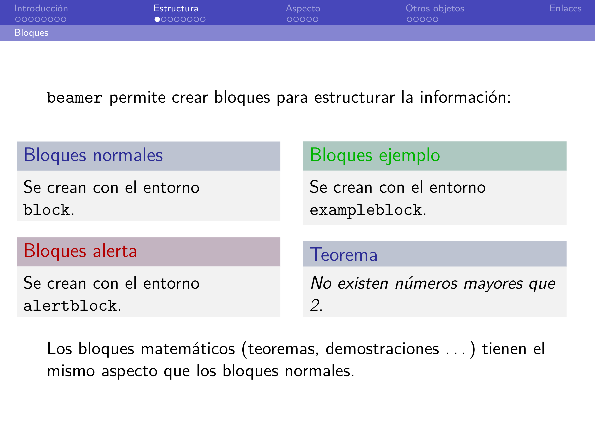

# Linux

## Distros

* Hay **muchas**, pruébalas (modo Live)

* También puedes elegir entorno de escritorio (GNOME, KDE, Cinnamon...)

* Tener un entorno de desarrollo a tu gusto es importante

## Ubuntu

. . .

* La más usada y la más fácil de usar

* Variantes: **Linux Mint**, **Elementary**

## Arch

* Rolling Release: Siempre actualizada

* Documentación &rarr; &infin; (Arch Wiki)

* Variantes: **Antergos**, **Manjaro**

## La terminal

* Atajos útiles: &uarr;, &#8633;, Ctrl+R

* Tiene más posibilidades que la GUI

~~~bash
mkdir -p la/terminal/es/mas/rápida
~~~

* Si repites los mismos comandos muchas veces, crea un *alias* o un *script*

* Termina automatizando todas las tareas rutinarias

* **[Cheat sheet](https://goo.gl/MWOfkx)**

# LaTeX

## vs. Word, ODT

* $\mathrm\LaTeX$ es texto plano

* Nivel de detalle mucho mayor

* Es extensible, hay paquetes para todo

* Está en la web: **MathJax**

* Para empezar: **TeXstudio**

* **TeXLive** (Linux), **[MiKTeX](http://miktex.org/)** (Windows),  
    **[MacTeX](https://www.tug.org/mactex/)** (OS X), **[Overleaf](https://www.overleaf.com/)**

## Comandos y entornos

* Comandos:

    `\`*nombre*`[`*opciones*`]{`*parámetro1*`}{`*parámetro2*`}`...

    `\textbf`, `\textit`, `\texttt`, `\color`

* Entornos: delimitados con `\begin{entorno}` y `\end{entorno}`

    `verbatim`, `table`, `figure`, `itemize`, `enumerate`, `theorem`

**[LaTeX Wikibook](https://en.wikibooks.org/wiki/LaTeX)**

## Documentos

* Cabecera: `\documentclass`, `\title`, `\author`

* `\begin{document}`...`\end{document}`

* `\section`, `\subsection`, `\subsubsection`...

**[M42/plantillas](https://github.com/M42/plantillas)**  

**[andreshp/LatexTemplates](https://github.com/andreshp/LatexTemplates)**

## Ecuaciones

* En línea: \$e^{i \\pi} + 1 = 0\$ &rarr; $e^{i \pi} + 1 = 0$

* En bloque: entornos `equation`, `eqnarray`
$$
  \delta_{ij} =
  \begin{cases}
    1 & \mbox{ si } i = j \\
    0 & \mbox{ en otro caso}
  \end{cases}
$$

* Paquete `amsmath`: **[amsmath User's Guide](ftp://ftp.ams.org/pub/tex/doc/amsmath/amsldoc.pdf)**

**[Detexify](http://detexify.kirelabs.org/classify.html)**

**[HostMath](http://hostmath.com/)**

## Presentaciones

* `\documentclass{beamer}`

* **[dgiim/beamer](https://github.com/dgiim/beamer)**

---

# Git + GitHub

## Git

* Es un sistema de control de versiones

* Trabajar con varias personas (sin machacar código)

* Retroceder a una versión anterior del código

* Separar el trabajo en un proyecto por ramas

**[Manual rápido de GitHub/Git](https://dgiim.github.io/blog/2014/02/23/manualgit/)**

**[Git cheatsheet](https://training.github.com/kit/downloads/github-git-cheat-sheet)**

## Comandos de Git

* `git init` inicializa un repo

    `git clone` clona uno existente

    `git pull` trae cambios del *remoto*

* `git add` selecciona archivos modificados (y `git reset` los deselecciona)

    `git commit` confirma cambios en los archivos

    `git push` envía cambios desde el *local*

* `checkout`, `merge`, `diff`, `log`, `revert`...

## GitHub

* Alojamiento de repos públicos

* **[GitHub Education](http://education.github.com/)**: repos privados y más cosas

* Organizaciones: **[/dgiim](http://github.com/dgiim)**

* Es vuestro currículum en empresas tecnológicas

# Recursos y proyectos

## Doble Grado

[**Foro** (dgiim.github.io/foro)](https://dgiim.github.io/foro)

[**Awesome** (dgiim.github.io/awesome)](https://dgiim.github.io/awesome)

[**Blog** (dgiim.github.io/blog)](https://dgiim.github.io/blog)

[**Twitter** (twitter.com/dgiimgr)](https://twitter.com/dgiimgr)

## Oficina de Software Libre

* **#JuevesEnLaETSIIT**

* GitHub Meetups

* Certamen de Proyectos Libres

* Talleres, Hackathones...

* **[\@oslugr](https://twitter.com/oslugr)**, **[osl.ugr.es](http://osl.ugr.es)**

## Otros

* **[Python Granada](http://www.python-granada.es/)**

## {.titleslide#backslide}

<!--link href='http://fonts.googleapis.com/css?family=Open Sans:400,300,700' rel='stylesheet' type='text/css'-->

